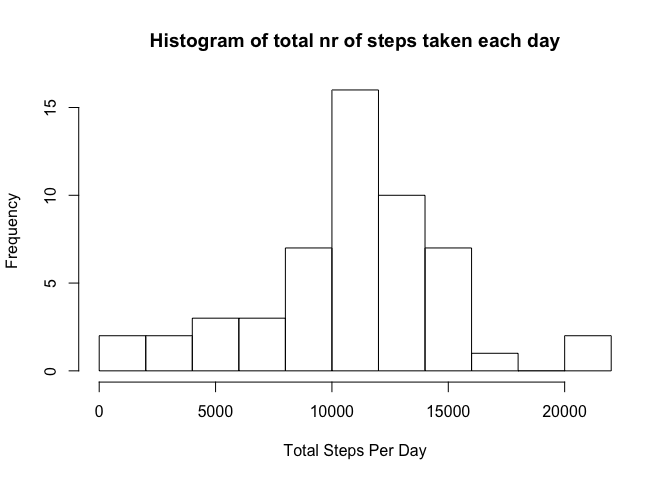

# Reproducible Research: Peer Assessment 1


## Loading and preprocessing the data
Read the data:

```r
library(dplyr)
```

```
## Warning: package 'dplyr' was built under R version 3.1.2
```

```
## 
## Attaching package: 'dplyr'
## 
## The following object is masked from 'package:stats':
## 
##     filter
## 
## The following objects are masked from 'package:base':
## 
##     intersect, setdiff, setequal, union
```

```r
library(lattice)
data <- read.csv(file="activity.csv", header=TRUE)
```

Turn the interval column into factors

```r
data$interval <- factor(data$interval)
```

## What is mean total number of steps taken per day?

First, we sum the number of steps per day:

```r
per_day <- group_by(data, date)
stepsPerDay <- summarise(per_day, totalSteps=sum(steps))
```

Next, here is a histogram of the total number of steps taken each day, using 10 bins:


```r
hist(stepsPerDay$totalSteps, breaks=10, main="Histogram of total nr of steps taken each day", xlab="Total Steps Per Day")
```

 

The mean of the totalSteps per day is:

```r
mean(stepsPerDay$totalSteps, na.rm = TRUE)
```

```
## [1] 10766.19
```

The median of the totalSteps per day is:

```r
median(stepsPerDay$totalSteps, na.rm = TRUE)
```

```
## [1] 10765
```

## What is the average daily activity pattern?

We group the data by interval, and then find the mean (average) for each interval.
Then we create a plot of these data points.


```r
per_interval <- group_by(data, interval)
stepsPerInterval <- summarise(per_interval, averageSteps=mean(steps, na.rm=TRUE))
plot(stepsPerInterval$interval, stepsPerInterval$averageSteps,  main="Average steps per interval", xlab="Interval", ylab="Average Steps" ) 
lines(stepsPerInterval$interval, stepsPerInterval$averageSteps, type="l" )
```

 

The 5-minute interval, that contains the maximum number of steps (average across all days in dataset) is:

```r
stepsPerInterval[which.max(stepsPerInterval$averageSteps),1]
```

```
## Source: local data frame [1 x 1]
## 
##   interval
## 1      835
```

## Imputing missing values

1. The nr of missing values in the data set is:

```r
sum(is.na(data$steps))
```

```
## [1] 2304
```


2. We will fill in NA values, by using the mean of all intervals for that day. If the mean of that day is also NA, we set it the mean (and thus also the interval value) to be 0.

3. Create the data set filledData:


```r
# Group data by date
per_day <- group_by(data, date)

# Get average steps per day
averageStepsPerDay <- summarise(per_day, averageSteps=mean(steps))

# Set all NA values to be 0
averageStepsPerDay$averageSteps[is.na(averageStepsPerDay$averageSteps)] <- 0

# Merge the two data sets, so we have the day average in each row of the original data set
filledData <- merge(data, averageStepsPerDay, by="date")

# Use the averageSteps data to fill in any NA values
filledData$steps[is.na(filledData$steps)] <- filledData$averageSteps[is.na(filledData$steps)]
```

4. Now let's make a histogram again, for this new filled in data set:

```r
per_day2 <- group_by(filledData, date)
stepsPerDay2 <- summarise(per_day2, totalSteps=sum(steps))
hist(stepsPerDay2$totalSteps, breaks=10, main="Histogram of total nr of steps taken each day", xlab="Total Steps Per Day")
```

 

The mean of the totalSteps per day is now:

```r
mean(stepsPerDay2$totalSteps, na.rm = TRUE)
```

```
## [1] 9354.23
```

The median of the totalSteps per day is now:

```r
median(stepsPerDay2$totalSteps, na.rm = TRUE)
```

```
## [1] 10395
```

The values are different. This is mostly because many of the missing values became 0, skewing the mean and median.

## Are there differences in activity patterns between weekdays and weekends?

We will group the data by weekday and weekend, and then plot it.


```r
# Add column with weekdays
filledData$day <- weekdays(as.Date(filledData$date,'%Y-%m-%d'))

# Add column categorizing weekdays vs weekend
filledData$weekday <- ifelse(filledData$day %in% c("Saturday", "Sunday"), "Weekend", "Weekday")

# Make this column a factor
filledData$weekday <- factor(filledData$weekday)

#Group by interval and weekday
groups2 <- group_by(filledData, interval, weekday)
weekdayData <- summarise(groups2, averageSteps=mean(steps))

#Create the plot
xyplot(averageSteps ~ interval | weekday, data=weekdayData,type='l', layout=c(1,2), main="Average steps per interval - Weekend vs Weekdays", xlab="Interval", ylab="Average Steps")
```

 

