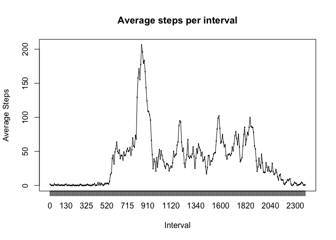

# Reproducible Research: Peer Assessment 1


## Loading and preprocessing the data
Read the data:

```r
library(dplyr)
```

```
## Warning: package 'dplyr' was built under R version 3.1.2
```

```
## 
## Attaching package: 'dplyr'
## 
## The following object is masked from 'package:stats':
## 
##     filter
## 
## The following objects are masked from 'package:base':
## 
##     intersect, setdiff, setequal, union
```

```r
data <- read.csv(file="activity.csv", header=TRUE)
```

Turn the interval column into factors

```r
data$interval <- factor(data$interval)
```

## What is mean total number of steps taken per day?

First, we sum the number of steps per day

```r
per_day <- group_by(data, date)
stepsPerDay <- summarise(per_day, totalSteps=sum(steps))
```

Here is a histogram of the total number of steps taken each day, using 10 bins

```r
hist(stepsPerDay$totalSteps, breaks=10)
```

 

The mean of the totalSteps per day is:

```r
mean(stepsPerDay$totalSteps, na.rm = TRUE)
```

```
## [1] 10766.19
```

The median of the totalSteps per day is:

```r
median(stepsPerDay$totalSteps, na.rm = TRUE)
```

```
## [1] 10765
```

## What is the average daily activity pattern?


```r
per_interval <- group_by(data, interval)
stepsPerInterval <- summarise(per_interval, averageSteps=mean(steps, na.rm=TRUE))
plot(stepsPerInterval$interval, stepsPerInterval$averageSteps ) 
lines(stepsPerInterval$interval, stepsPerInterval$averageSteps, type="l")
```

 

The 5-minute interval, that contains the maximum number of steps (average across all days in dataset) is:

```r
stepsPerInterval[which.max(stepsPerInterval$averageSteps),]
```

```
## Source: local data frame [1 x 2]
## 
##   interval averageSteps
## 1      835     206.1698
```

## Imputing missing values
1. The nr of missing values in the data set is:

```r
sum(is.na(data$steps))
```

```
## [1] 2304
```


2. We will fill in NA values, by using the mean of that day.


```r
#copy the data set
dataFilled <- data
#group data by date
per_day <- group_by(dataFilled, date)
#get average steps per day
averageStepsPerDay <- summarise(per_day, averageSteps=mean(steps))
#Set all NA values to be 0
averageStepsPerDay$averageSteps[is.na(averageStepsPerDay$averageSteps)] <- 0
combinedData <- merge(dataFilled, averageStepsPerDay, by="date")
#use the averageSteps data to fill in any NA values
combinedData$steps[is.na(combinedData$steps)] <- combinedData$averageSteps[is.na(combinedData$steps)]
```


## Are there differences in activity patterns between weekdays and weekends?
